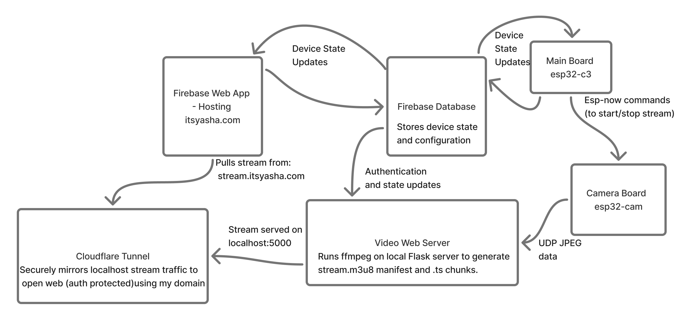

# 🦎 Tank Control System

## Overview

The Tank Control System is a versatile, extensible platform designed to manage and automate environmental conditions for animal enclosures—originally tailored for lizard habitats 🦎, but easily adaptable to a wide range of applications such as aquariums 🐠, terrariums 🌱, and smart home projects 🏠.

## 🚦 Getting Started

1. **🔌 Hardware:**
   - ESP32-based controller (e.g., M5Stamp C3)
   - Supported sensors (DHT11, AHT20, MLX90614 etc.)
   - **ESP32-CAM board** (separate board required due to signal issues with long camera cables)
   - Relays for external device control (e.g. turn lamps on/off)
2. **📷 ESP32-CAM Setup:**
   - Use a separate ESP32-CAM board for camera functionality
   - Board-to-board communication via ESP-NOW protocol
   - Basic camera control: `camera_action=0` (stop streaming), `camera_action=1` (start streaming), `camera_action=2` (update FPS)
   - Check board pinout when adapting to other ESP32-based boards
   - Full message protocol details available in `MessageTypes.h`
3. **💻 Software:**
   - PlatformIO/Arduino framework
   - Configure Wi-Fi and Firebase credentials in `src/config/Credentials.h`
   - Build and upload firmware to both boards:
     - Main board: `pio run -e main-board -t upload`
     - Camera board: `pio run -e camera-board -t upload`
   - Firebase RealtimeDatabase needed for LAN control and stream viewing, for WAN you need to create a Firebase Web App. I've done everything on the free tier!
4. **🌍 Web Interface:**

   - For LAN: Instruction coming soon!
   - For WAN: Instruction coming soon!

   ### 📸 Block Diagram of System Architecture

   

## ✨ Key Features

- **🌡️ Sensor Integration:** Supports temperature, humidity, and other environmental sensors for real-time monitoring.
- **📷 Camera Integration:** Captures and streams live video from inside the tank, viewable via a web interface from anywhere (WAN support).
- **🌐 Web-Based Control:** Provides a web page for remote monitoring and control of tank devices (lights, heat lamps, etc.).
- **🔥 Mountable IR Heat Sensor:** Many existing temperature sensors fail to accurately capture the surface temperature of the basking spot. A mountable IR sensor solves that issue - it just needs line of sight to the surface.
- **⏰ Time-of-Day & Temperature Automation:** Automatically controls devices based on user-defined schedules and temperature thresholds.
- **🧩 Extensible Device Management:** Easily add or modify devices and sensors for different species or use cases.

## 🏗️ In Progress

- **🌦️ Weather Data Integration:** Match tank conditions to the native environment of the animal by pulling real-time weather data from their natural habitat. This includes temperature/humidity control and simulated sunrise/sunset and light levels throughout the day.

## 🚀 Planned Features

- **🤖 AI Computer Vision:** Integrate AI-based image analysis to detect key events (e.g., animal activity, feeding, abnormal behavior) and send notifications or alerts.
- **💡 Light Sequencing & Intensity Control:** Create a custom order and timing in which lights should turn on/off, and set intensities of the included LED strip for different times of day.
- **🌡️ Multi Sensor Control:** Multi sensor control will allow users to define more complex rules on how devices should behave.
- **📊 Sensor & Event Logging:** Recorded sensor data (temperature, humidity, etc.) and key events (including camera-detected events) for historical analysis. And a camera and log lookback mode to review past conditions and events in the tank, helping with troubleshooting, animal health monitoring, and behavior analysis.

## 🧩 Extending the System

- ➕ Add new sensors or devices by creating new classes in the `src/devices/` or `src/sensors/` directories
- 🛠️ Modify automation logic in `main.cpp` or device classes
- 🤝 Integrate additional APIs or AI modules as needed

## 🤝 Contributing

Contributions are welcome! Please open issues or submit pull requests for new features, bug fixes, or documentation improvements.

---

_This project is under active development. Stay tuned for more features and improvements!_ 🚧
